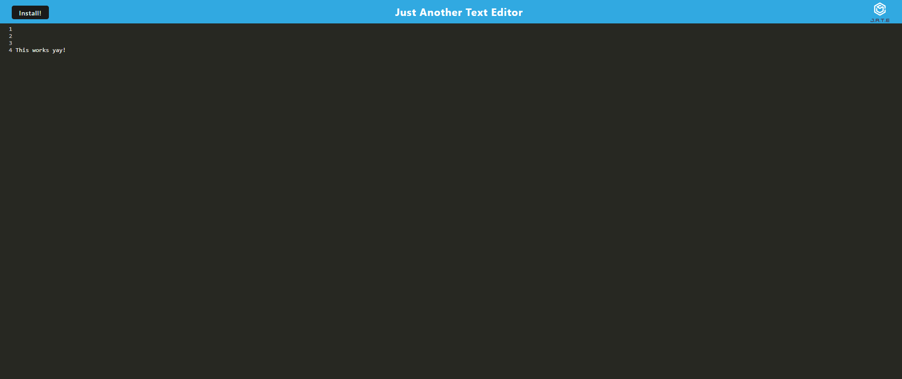
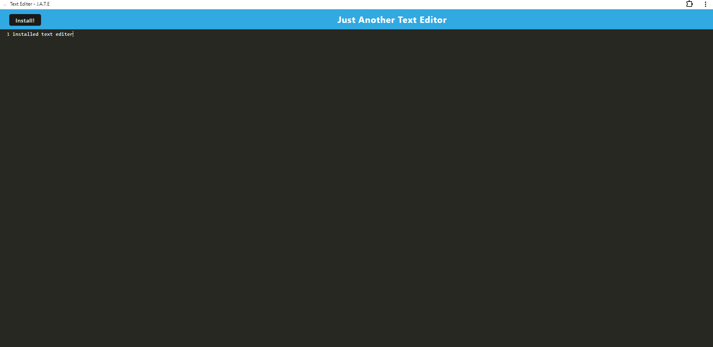

# Text Editer PWA update

by Ethan Verellen

## Table of Contents

[Description](#description)

[Useage](#useage)

[Installation](#installation)

[Images](#images)

[Tests](#tests)

[Contributors](#contributors)

[Links](#links)

[Questions](#questions)

## Description

This is an update to a text editer to allow for instalations of it on the computer or other device.

## Useage

Go into a terminal/git bash, find your way to the folder and type in the line npm install and npm run build.  Then type in npm run start:dev.

## Installation

To install, Either download as a zip file from the repo, or git clone in gitbash or other equivelences.

## Images

## Tests

play with it

## Contributing

Ethan Verellen

## Links

https://github.com/Ethan-Verellen/text-editor-PWA-update-

## Questions

https://github.com/Ethan-Verellen

ethanverellen@gmail.com

